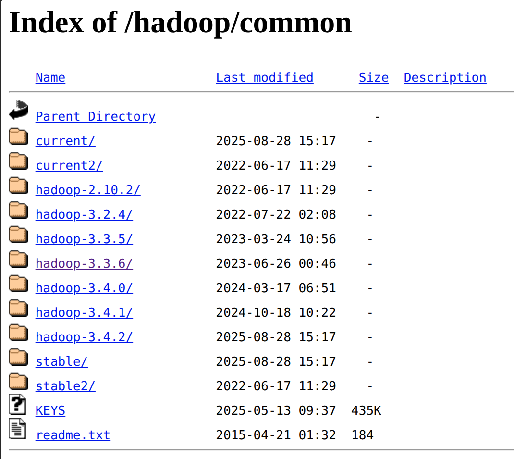
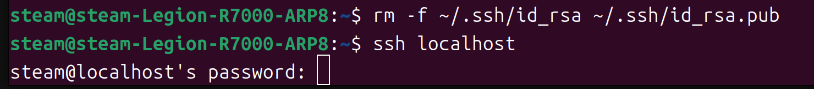
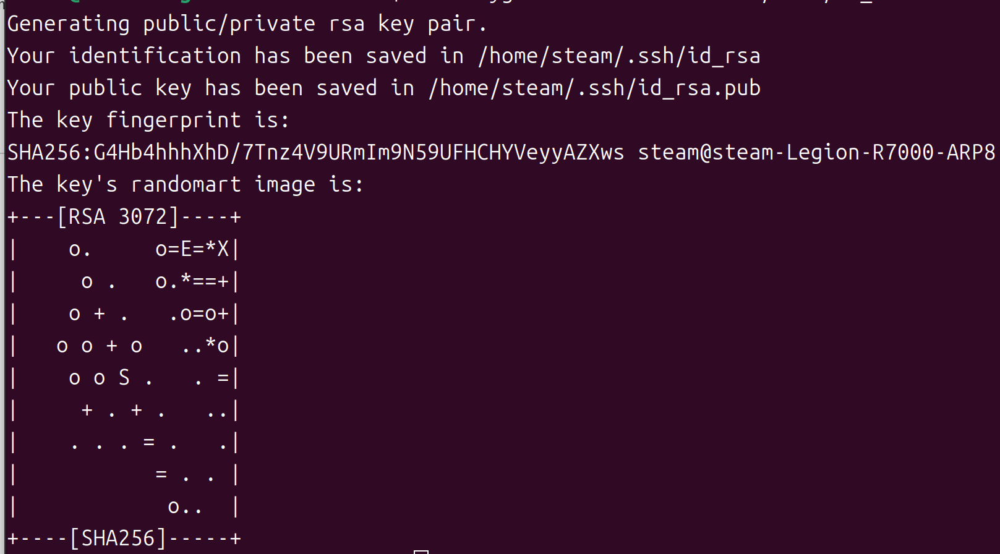
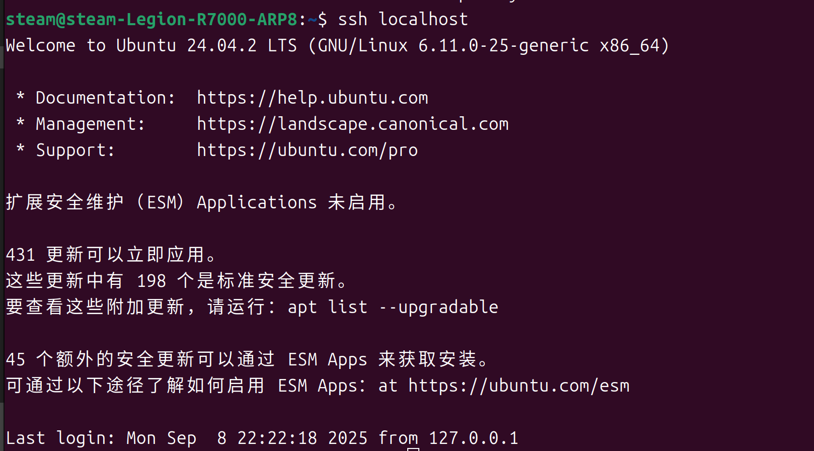
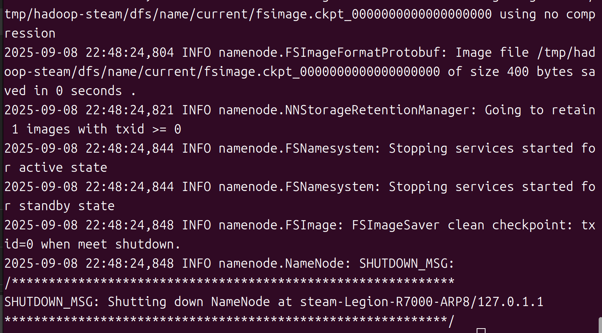
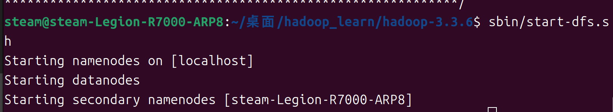
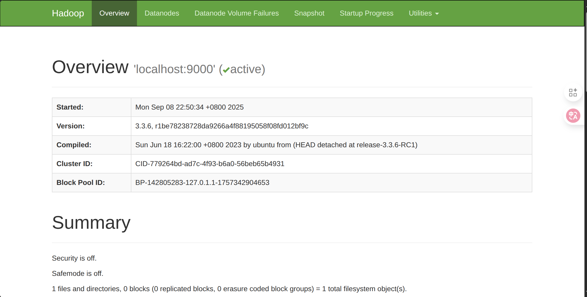

# hadoop_learn-base-on-official-file
**学习hadoop的使用，目前是在ubuntu24.04上实现的伪分布式**

*以下文章基于官方文档以及部分ai的提问。*

首先你想要使用Hadoop集群，你需要下载一个合适的Hadoop的版本，这个版本可以在官网找到，截至本篇教程制作之日，有如图的版本可选择我下载的是hadoop-3.3.6.tar.gz

版本下面的目录拥有不同的格式下面讲解部分常用格式的类型和使用说明：

<!-- 带边框的 Hadoop 3.3.6 文件对照表 -->
<table border="1" style="border-collapse: collapse; width: 100%;">
  <thead>
    <tr>
      <th>文件名</th>
      <th>类型</th>
      <th>说明</th>
      <th>使用场景</th>
    </tr>
  </thead>
  <tbody>
    <tr>
      <td><code>hadoop-3.3.6.tar.gz</code></td>
      <td>二进制包（编译好的）</td>
      <td>包含 Hadoop 编译后的可执行文件、库、脚本等，<strong>不包含源码</strong>。</td>
      <td>✅ 生产环境部署、开发测试环境快速搭建。</td>
    </tr>
    <tr>
      <td><code>hadoop-3.3.6-src.tar.gz</code></td>
      <td>源码包</td>
      <td>Hadoop 的完整源代码，<strong>需要自行编译</strong>。</td>
      <td>✅ 需要自定义编译、研究源码、做二次开发。</td>
    </tr>
    <tr>
      <td><code>hadoop-3.3.6-aarch64.tar.gz</code></td>
      <td>ARM64 架构二进制包</td>
      <td>针对 ARM64（如鲲鹏、苹果 M 系列、树莓派等）优化编译的版本。</td>
      <td>✅ ARM64 架构服务器或设备上使用。</td>
    </tr>
    <tr>
      <td><code>hadoop-3.3.6-site.tar.gz</code></td>
      <td>文档包</td>
      <td>包含 Hadoop 官方网站的静态 HTML 文档（即官网的本地镜像）。</td>
      <td>✅ 离线查看官方文档、内网部署文档站点。</td>
    </tr>
    <tr>
      <td><code>hadoop-3.3.6-rat.txt</code></td>
      <td>许可证审计报告</td>
      <td>Apache RAT 工具生成的报告，检查源码中是否包含合规的许可证头。</td>
      <td>✅ 开发者/维护者用于合规审计，普通用户无需关心。</td>
    </tr>
  </tbody>
</table>

望读者按需下载，这篇文章下载的是hadoop-3.3.6.tar.gz

下载好后先不要急着解压，需要先确保当前系统中含有ssh和pdsh两个包。如果没有，请输入用以安装
```
sudo apt-get install ssh
sudo apt-get install pdsh
```
OK，现在可以将下载好的文件解压到一个你可以找到的地方，使用命令解压
```
cd 你hadoop包下载到的目录
tar -xzf 你的hadoop包名字 -C 想要解压到的文件夹
#别傻乎乎把中文写上去了，改成你自己的路径和版本等，后续不提了
```
解压好后，你会看见如图：
下一步你需要保证你的环境中有java，版本一般没有适配性问题，不过可以注意搜一下。
在终端输入
```
nano etc/hadoop/hadoop-env.sh
```
这是hadoop的环境配置文件，你打开后寻找java，大概率是找不到的，需要你自己添加：
```
export JAVA_HOME=你的java路径
```
*这里注意：你的java路径一定是一个文件夹而非可执行文件，如果是那大概率是链接*

这时候终端输入命令：
```
readlink -f $(which java) 
```
之后删除/bin/java就是你的java路径。

OK，路径配好后，请尝试
```
bin/hadoop
```
看是否显示hadoop使用文档（即一大堆英文）如果是，就可以开始准备部署了！

## 开始尝试部署伪分布式集群
### 1.首先修改必要配置
将etc/hadoop/core-site.xml文件中内容修改为
```
<configuration>
    <property>
        <name>fs.defaultFS</name>
        <value>hdfs://localhost:9000</value>
    </property>
</configuration>
```
将etc/hadoop/hdfs-site.xml内文件修改为
```
<configuration>
    <property>
        <name>dfs.replication</name>
        <value>1</value>
    </property>
</configuration>
```
### 2.设置本地无密码ssh
首先在终端输入
```
ssh localhost
```
在连接时候如果是第一次安装会遇到这种情况：如图，需要输入密码

这种情况下，我们需要配对密钥，请按照以下步骤进行。
在你的终端中依次输入下面三行代码：
```
#生成RSA密钥
ssh-keygen -t rsa -P '' -f ~/.ssh/id_rsa
#把公钥追加到本机
cat ~/.ssh/id_rsa.pub >> ~/.ssh/authorized_keys
#修正权限宽度
chmod 0600 ~/.ssh/authorized_keys
```
**每一步反馈如下：**

#生成RSA密钥

#把公钥追加到本机
无输出
#修正权限宽度
无输出

此时再次执行```ssh localhost```则会出现如下图所示：

现在就完成了电脑的免密配置，可以开始连接，并进行文件操作了！

### 3.执行作业
首先格式化文件系统，在终端中你的hadoop文件夹中输入代码
```
bin/hdfs namenode -format
```
终端输出是，前面一大段乱七八糟的东西，结尾为：
之后如果想运行文件系统，需要启动 NameNode 守护进程和 DataNode 守护进程，代码为：
```
sbin/start-dfs.sh
```
终端输出为：

此时进程就开始运行了，hadoop守护进程日志输出将默认写入目录```你的hadoop文件夹/logs```

好，现在请你在你的浏览器输入“http://localhost:9870/ “ 这是浏览 NameNode 的默认 Web 界面;

你将看到

至此，伪分布式的部署完成了，下一步就是对文件进行的操作了